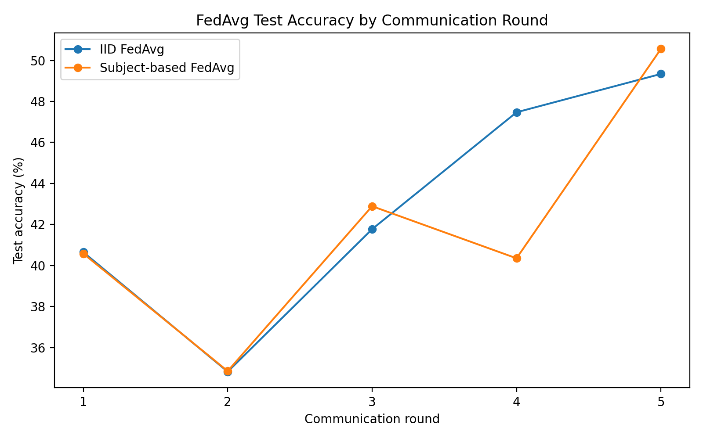
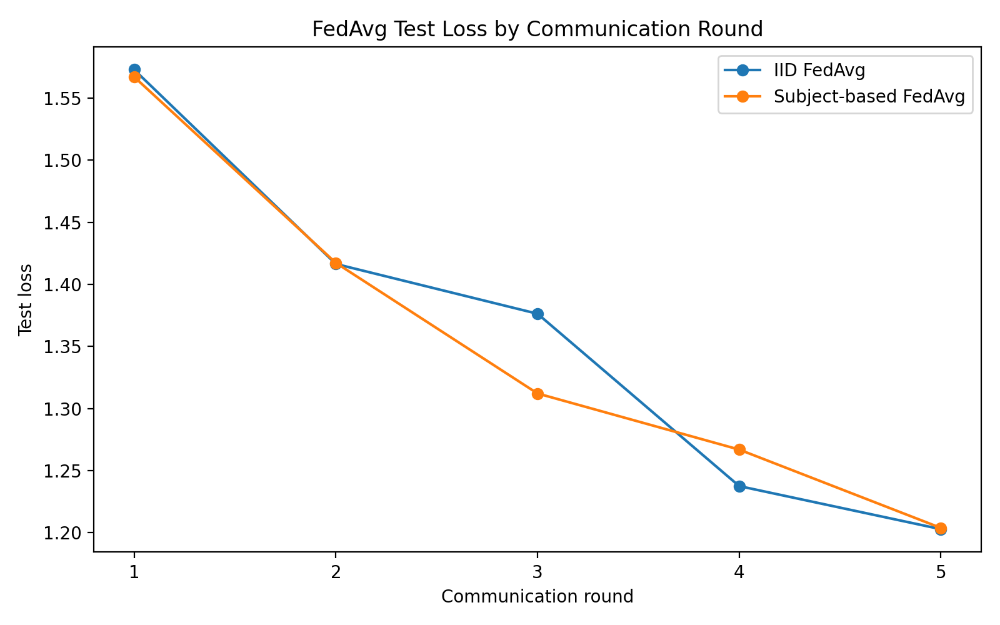

# Federated Time-Series Learning under Heterogeneous Clients

A research-oriented PyTorch implementation for studying **federated learning on heterogeneous time-series clients**, using UCI Human Activity Recognition (UCI HAR) as a controlled experimental platform.

The project is being developed toward a broader research question:

> **Which measurable properties of heterogeneous time-series clients determine when local adaptation is beneficial, and can these signals be used to condition local–global knowledge sharing during federated time-series foundation-model adaptation?**

## Research progression

The repository is organized as an experimental progression rather than a single benchmark:

1. **Establish a FedAvg baseline** under IID and subject-based client partitions.
2. **Measure client heterogeneity** using statistical, temporal, representation, and model-update signals.
3. **Quantify personalization need** by testing how much each client benefits from retaining its local model relative to the global model.
4. **Test whether heterogeneity signals explain personalization benefit** across communication rounds and random seeds.
5. **Next:** construct controlled heterogeneity levels and use the resulting evidence to design an adaptive local–global sharing mechanism.

The current implementation focuses on steps 1–4. It does **not** yet implement the final adaptive aggregation mechanism.

## Dataset and model

The current controlled platform uses the **UCI Human Activity Recognition Using Smartphones** dataset:

- 7,352 training samples and 2,947 test samples
- 128 time steps × 9 inertial-signal channels
- 6 activity classes
- Subject identifiers retained for client partitioning
- LSTM classifier implemented in PyTorch
- 4 simulated federated clients

The UCI HAR task is used for mechanism discovery. The longer-term research direction is to transfer the findings to multivariate forecasting and time-series foundation-model adaptation.

## Federated baseline

The baseline implements **sample-weighted FedAvg** without a federated-learning framework such as Flower.

Two partitioning conditions are currently evaluated:

- **IID:** training samples are distributed approximately uniformly across clients.
- **Subject-based:** clients are formed from subject-based partitions, introducing client-level distribution differences.

Baseline configuration:

- 5 communication rounds
- 1 local training epoch per round
- 4 clients
- Global evaluation on the held-out UCI HAR test set after each round

### Preliminary FedAvg results

The current single-seed baseline reaches the following round-5 results:

| Partition | Test accuracy | Test loss |
|---|---:|---:|
| IID | 49.34% | 1.2029 |
| Subject-based | 50.56% | 1.2039 |

The two final accuracies differ by only 1.22 percentage points in this run. Because this is a single run per condition, the result is treated as a **baseline observation, not evidence that one partitioning strategy is superior**.

### Test accuracy by communication round



### Test loss by communication round



| Round | IID accuracy | Subject-based accuracy | IID loss | Subject-based loss |
|---:|---:|---:|---:|---:|
| 1 | 40.65% | 40.58% | 1.5730 | 1.5672 |
| 2 | 34.82% | 34.85% | 1.4165 | 1.4174 |
| 3 | 41.77% | 42.89% | 1.3764 | 1.3122 |
| 4 | 47.47% | 40.35% | 1.2376 | 1.2670 |
| 5 | 49.34% | 50.56% | 1.2029 | 1.2039 |

The trajectories are not strictly monotonic; for example, both conditions show an accuracy drop at round 2. These results motivate further controlled experiments rather than a performance claim.

## Measuring heterogeneity

The project measures several client-level signals to investigate whether different forms of heterogeneity relate to personalization:

- **Label/distribution divergence**
- **Temporal characteristics**, including autocorrelation-based measurements
- **Representation distance**
- **Model/update divergence**
- **Parameter-level differences**

The goal is not to assume that one metric is the correct definition of heterogeneity. Instead, the experiments treat heterogeneity as multidimensional and test which measurable properties, if any, are informative about the value of local adaptation.

## Personalization experiment

A local/global interpolation sweep is used to quantify client-specific personalization preference.

For a client model $w_i^{local}$ and global model $w^{global}$:

$$
w_i(\alpha) = (1-\alpha)w^{global} + \alpha w_i^{local},
\qquad \alpha \in [0,1].
$$

The experiment evaluates a grid of $\alpha$ values from 0 to 1. The locally preferred value $\alpha_i^*$ is selected using a **local validation split**, not the official test set.

This gives an empirical measure of how much local information a client prefers to retain under the current training state:

$$
\alpha_i^* = \arg\max_{\alpha} V_i(w_i(\alpha)).
$$

Here, $\alpha_i^*$ is treated as a **validation-derived personalization preference**, not a ground-truth optimum.

### Preliminary personalization observations

For the initial single-seed experiment:

| Partition | Mean $\alpha^*$ | Median $\alpha^*$ | Clients with $\alpha^*>0.5$ | Mean validation gain |
|---|---:|---:|---:|---:|
| IID | 0.445 | 0.3 | 45% | +7.4 pp |
| Subject-based | 0.615 | 0.7 | 60% | +8.0 pp |

These observations suggest that local adaptation can matter even in this small controlled setting, but they are not sufficient to establish a general relationship between heterogeneity and personalization.

## Seed replication

The personalization analysis has also been repeated across five seeds:

**42, 123, 456, 789, 2026**

For the exploratory relationship between model-update divergence and selected $\alpha^*$, the mean round-level Spearman correlations across seeds were:

| Seed | Mean correlation |
|---:|---:|
| 42 | +0.456 |
| 123 | -0.105 |
| 456 | +0.401 |
| 789 | +0.076 |
| 2026 | +0.272 |

Across the available round-level observations, 16 of 24 correlations were positive, but the direction and magnitude vary substantially by seed.

This is therefore treated as an **exploratory signal, not a validated predictor**. Each round contains only four clients, so within-round correlation estimates are especially unstable.

## Current research question

The experiments are now being used to move beyond the question of whether personalization helps toward a more specific mechanism:

> **Which measurable properties of heterogeneous time-series clients determine when local adaptation is beneficial, and can these signals be used to condition local–global knowledge sharing during federated time-series foundation-model adaptation?**

The working hypothesis is that the useful local/global balance may depend on both:

- the client's current heterogeneity relative to other clients, and
- the evolving state of federated optimization.

A future adaptive mechanism will investigate a client- and round-dependent mixing coefficient:

$$
\alpha_{i,t} = f(H_{i,t}, S_t, \Delta H_{i,t}),
$$

where $H_{i,t}$ represents measurable client heterogeneity, $S_t$ represents training state, and $\Delta H_{i,t}$ captures changes in client/global divergence.

The equation describes the **research direction**, not an implemented contribution in the current repository.

## Repository structure

```text
.
├── data/
├── federated/
├── src/
├── experiments/
│   ├── centralized.py
│   ├── fedavg.py
│   ├── measure_heterogeneity.py
│   ├── personalization_sweep.py
│   ├── run_seed_replication.py
│   ├── analyze_heterogeneity_personalization.py
│   ├── analyze_measurements.py
│   ├── analyze_seed_replication.py
│   ├── analyze_within_round.py
│   └── plot_subject_personalization.py
├── results/
│   └── figures/
├── tests/
├── requirements.txt
└── README.md
```

## Reproducing the experiments

Create a Python environment and install the dependencies:

```bash
pip install -r requirements.txt
```

Run the baseline:

```bash
python -m experiments.fedavg --partition iid
python -m experiments.fedavg --partition subject
```

Run the personalization sweep:

```bash
python -m experiments.personalization_sweep --partition subject
```

Run heterogeneity measurement:

```bash
python -m experiments.measure_heterogeneity --partition subject
```

Run the seed replication:

```bash
python -m experiments.run_seed_replication
```

The exact command-line options available for each experiment should be checked with `--help` as the scripts evolve.

## Limitations

The current repository is a **research prototype**, not a production federated-learning system.

Key limitations:

- UCI HAR is a small controlled platform and is not itself a time-series foundation-model benchmark.
- The current FedAvg baseline uses only 5 communication rounds and 1 local epoch.
- The initial FedAvg comparison contains one run per partitioning condition.
- Personalization results use a small number of simulated clients.
- Within-round correlation analysis has only four clients per round and should not be interpreted as statistically reliable evidence.
- The current adaptive local–global sharing mechanism has not yet been implemented.
- The centralized baseline requires an aligned training budget before it can support meaningful convergence comparisons with FedAvg.

## Next experiments

The immediate experimental priority is a **controlled heterogeneity ladder**:

**IID → mild heterogeneity → moderate heterogeneity → strong heterogeneity**

This will make it possible to test whether personalization preference changes systematically as heterogeneity is increased, rather than relying only on the binary IID/subject-based comparison.

The next stage will then investigate whether changes in heterogeneity and training state can predict subsequent personalization benefit. Successful findings will motivate an adaptive local–global aggregation mechanism, followed by evaluation on multivariate forecasting and time-series foundation models.

## Citation / research use

This repository is intended as an experimental research artifact accompanying work on federated learning, heterogeneous time-series data, personalization, and adaptive local–global knowledge sharing.
